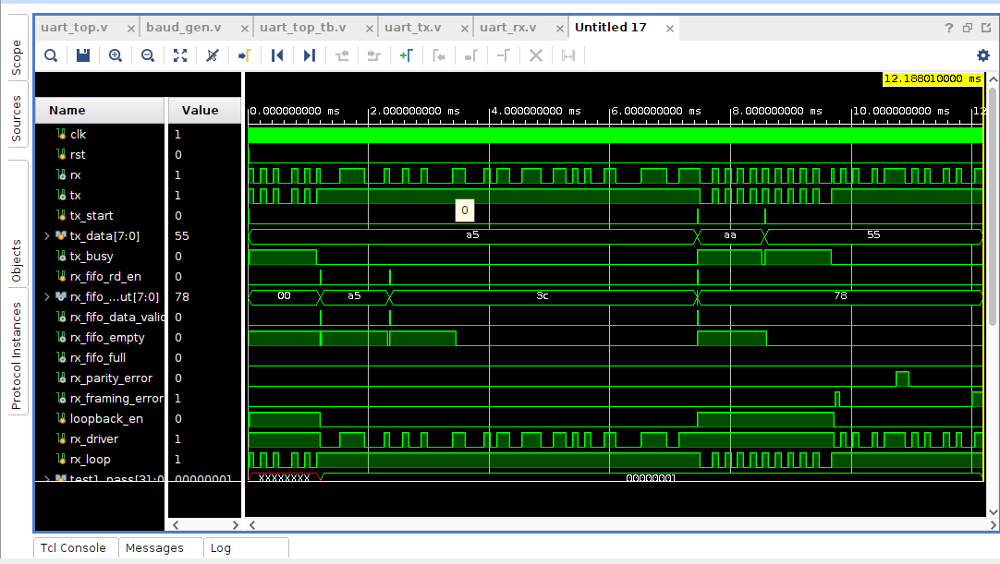
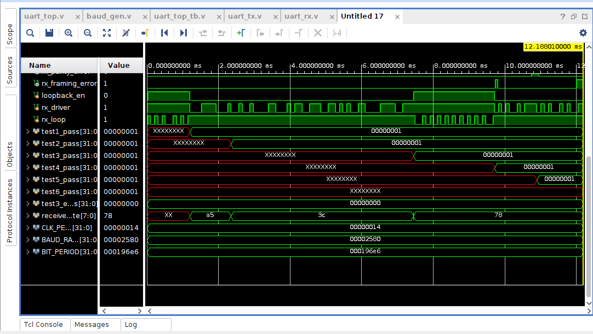

# 📡 UART with Asynchronous FIFO (Verilog)

## 📌 Project Overview
This project implements a **UART (Universal Asynchronous Receiver Transmitter)** system in Verilog integrated with an **Asynchronous FIFO** for reliable data buffering and transfer across modules.

The design supports:
- 📤 UART Transmission (TX)
- 📥 UART Reception (RX)
- 📦 FIFO buffering for received data
- ⏱️ Baud rate generation
- 🔐 Error detection (parity & framing)

This makes the system suitable for **FPGA/ASIC serial communication systems**.

---

## ⚙️ Features

- 📡 Full UART communication (TX + RX)
- ⏱️ Configurable baud rate (9600 default)
- 🔁 16x oversampling in receiver
- 🔐 Parity support (Even / Odd / Disabled)
- 📦 Asynchronous FIFO buffering
- ❗ Parity error detection
- 🚫 Framing error detection
- ⚡ CDC-safe FIFO design using synchronizers
- 🧪 Fully verified using testbench

---

## 🧠 Architecture

### 🔹 Modules Used

| Module        | Description |
|--------------|------------|
| `uart_top`   | Top-level integration |
| `baud_gen`   | Generates baud_tick & 16x sampling tick |
| `uart_tx`    | Serial transmitter |
| `uart_rx`    | Serial receiver with majority sampling |
| `async_fifo` | FIFO buffering and CDC handling |
| `uart_top_tb`| Testbench |

---

## 🔄 Data Flow

```text
TRANSMIT PATH:
User Data → uart_tx → Serial TX

RECEIVE PATH:
Serial RX → uart_rx → async_fifo → User Read


```

📤 UART Transmitter (uart_tx)
 1.Frame format:
    -> Start bit (0)
    -> 8 data bits (LSB first)
    -> Optional parity bit
    -> Stop bit (1)
 2.Uses shift register for serialization
 3.Controlled by baud_tick
 4.tx_busy indicates transmission in progress

 ---

📥 UART Receiver (uart_rx)
 1.Key Techniques:
    -> 🔁 16x oversampling
    -> 🧠 3-point majority voting
    -> 🔐 CDC-safe synchronization
 2.Operations:
    -> Start bit validation
    -> Data reception
    -> Parity checking
    -> Stop bit verification
3.Error Outputs:
    -> ❗ parity_error
    -> 🚫 framing_error

---


📦 Asynchronous FIFO

Used to buffer received data before user reads.
Features:
      1.Dual clock domain support
      2.Gray code pointer synchronization
      3.Two-stage synchronizers
      4.Full & Empty detection
      5.data_valid signal for read confirmation


---


⏱️ Baud Generator (baud_gen)

Generates:
      1.baud_tick → TX timing
      2.baud_16x_tick → RX sampling
Parameters:
      1.CLK_FREQ  = 50_000_000
      2.BAUD_RATE = 9600

---


🧪 Testbench Description (uart_top_tb)

The testbench validates UART and FIFO functionality using multiple real-world scenarios.

✔ Test Cases Covered
      1.Loopback Test
            -> TX connected to RX
            -> Verifies end-to-end communication
      2.Direct RX Injection
            -> External stimulus to RX
            -> Tests receiver independently
      3.FIFO Burst Test
            -> Multiple bytes transmitted
            -> Checks buffering and order
      4.Back-to-Back TX Test
            -> Continuous data transmission
            -> Ensures stability
      5.Parity Error Test
            -> Inject wrong parity
            -> Checks parity_error
     6.Framing Error Test
            -> Invalid stop bit
            -> Checks framing_error

---

📊 Simulation Output
🔹 Waveform 1 
          


🔹 Waveform 2 – Continution of Waveform 1
          


---


## 🖥️ Simulation Log (TCL Console Output)

-> The complete simulation output generated from `$display` statements is available here:

📄 [View Simulation Log](simulation_log.txt)

---

📂 Project Structure
```text

uart_fifo_project/
│
├── uart_top.v
├── baud_gen.v
├── uart_tx.v
├── uart_rx.v
├── async_fifo.v
├── uart_top_tb.v
├── README.md
├── simulation_log.txt
└── images/
    ├── waveform1.png
    └── waveform2.png
```

---


🔧 Design Highlights

      ✔ Modular design (TX, RX, FIFO separated)
      ✔ Robust RX using majority sampling
      ✔ Safe CDC using asynchronous FIFO
      ✔ Error detection implemented
      ✔ Industrial-style verification

---


🚀 How to Run
       -> Open project in Xilinx Vivado
       -> Add all .v files
       -> Set uart_top_tb as top module
       -> Run → Behavioral Simulation
       -> Observe:
             1. Waveforms
             2. Console output
---


🎯 Applications
       1. UART communication systems
       2. Embedded systems
       3. FPGA-based serial interfaces
       4. Data buffering systems
       5. Multi-clock domain communication

---


📜 License

    This project is licensed under the MIT License.

---


👨‍💻 Author

    SHAIK ABDUL MATHEEN

---

 Acknowledgement

     This project was developed as part of learning UART protocol, FIFO design, and  Clock Domain Crossing (CDC) concepts.


      


